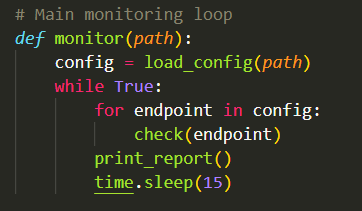
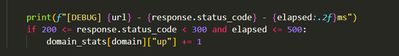
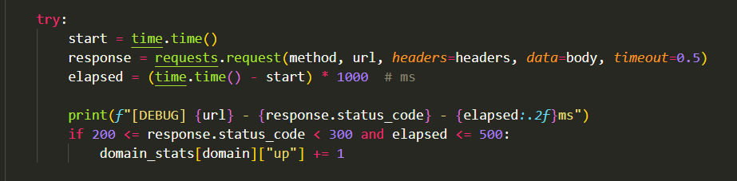
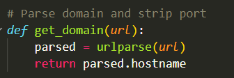
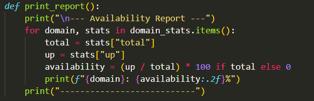
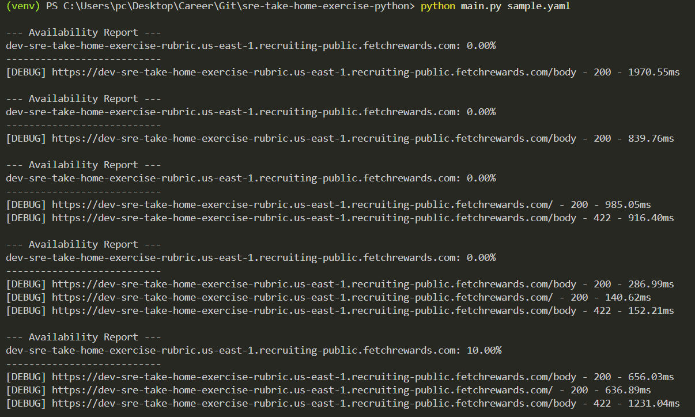

# Fetch Rewards – SRE Take-Home Exercise (Python)

## Overview

This tool checks the availability of HTTP endpoints defined in a YAML config file. It:
- Sends requests every 15 seconds
- Tracks response status (must be 200–299)
- Ensures response time is ≤ 500ms
- Groups results by domain (ignores ports)
- Logs cumulative availability % over time

---

## Files

- `main.py`: Main Python script
- `sample.yaml`: YAML config defining endpoints (already provided)
- `requirements.txt`: Python dependencies

---

## Setup & Installation

```bash
git clone https://github.com/YOUR_USERNAME/sre-take-home-exercise-python.git
cd sre-take-home-exercise-python

python3 -m venv venv
source venv/bin/activate

pip install -r requirements.txt

```

## Detailed Report:
I run the below line in my terminal
```bash
python main.py sample.yaml
```
The script reads the YAML config and begins checking endpoint availability every 15 seconds. It logs cumulative availability for each domain based on the criteria provided in the assessment.


1. Sends requests every 15 seconds
- The tool runs in a continuous loop and performs checks on all endpoints every 15 seconds.


2. Tracks response status (200–299 only)
- A request is only counted as available if it returns an HTTP status code between 200 and 299.


3. Ensures response time is ≤ 500ms
- Requests are timed, and only responses faster than 500ms are considered valid.


4. Groups results by domain (ignores ports)
- Ports are stripped using urlparse(url).hostname so multiple endpoints on different ports are grouped under the same domain.


5. Logs cumulative availability over time
- Each domain’s availability is tracked as (successful responses / total requests) * 100 over all cycles.


## Example Output:
- Below is a real-time execution screenshot showing [DEBUG] logs and increasing availability:

